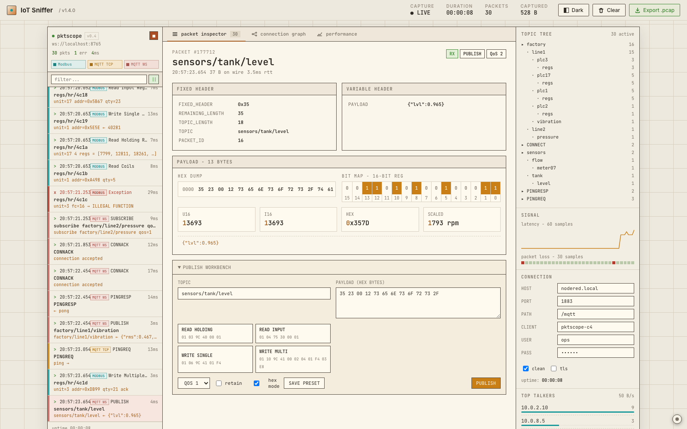
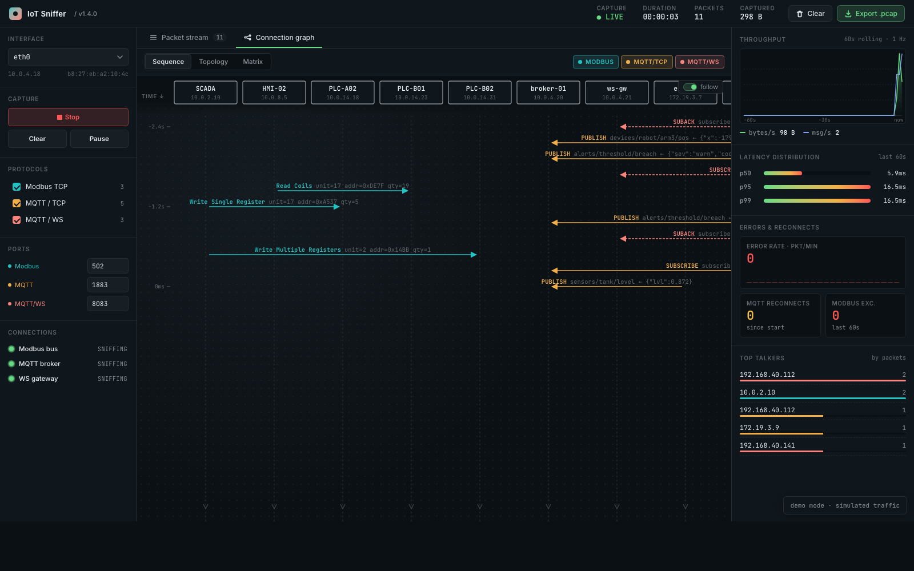
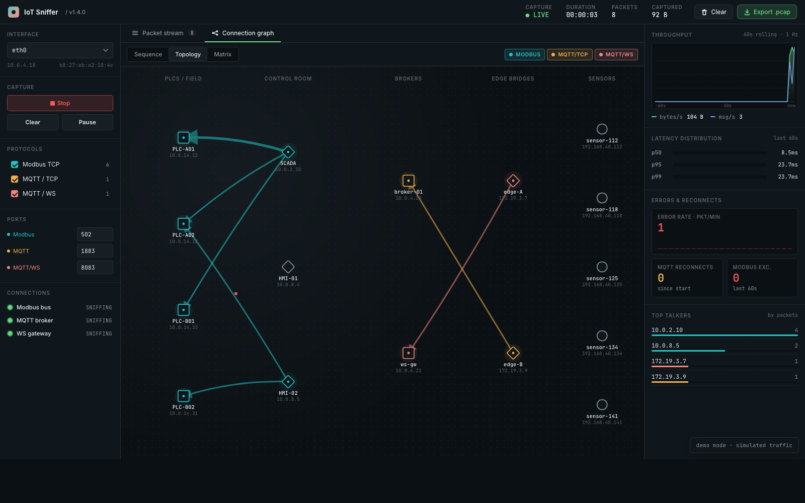
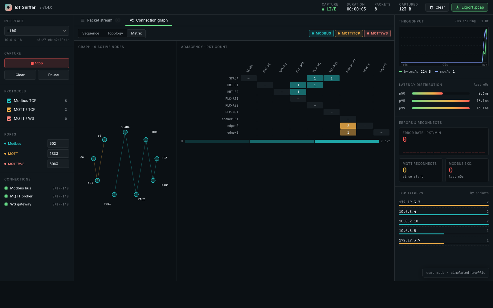

# IoT Sniffer

Real-time sniffer and dashboard for industrial-IoT protocols:

- **Modbus TCP** (default port 502)
- **MQTT over TCP** (default port 1883)
- **MQTT over WebSocket** (default port 8083)

The backend is a Python package that captures traffic on a named network
interface with scapy, reassembles TCP streams per flow, decodes frames
with pure-Python parsers (no external protocol libraries), computes live
metrics (throughput, p50/p95/p99 latency, MQTT jitter, TCP retransmits,
Modbus error rate, MQTT reconnects) and pushes both decoded frames and a
1 Hz metrics snapshot to the browser over WebSocket. The frontend is a
three-panel dark-theme dashboard served as static HTML.

## Screenshots

**Packet stream** — live table with protocol-colored rows, decode drawer
on row click, right-rail metrics (throughput, p50/p95/p99 latency,
errors, reconnects, top talkers):



**Connection graph · Sequence** — UML-style sequence diagram with device
lifelines at the top, vertical time axis flowing down, and per-message
arrows colored by protocol (dashed for MQTT/WS, red for errors):



**Connection graph · Topology** — devices grouped left-to-right by role
(PLCs → control room → brokers → edge → sensors); edges curve per
protocol so parallel flows between the same pair don't overlap; edge
thickness scales with packet count:



**Connection graph · Matrix** — circular complete-graph on the left
paired with an adjacency table on the right; cells shaded by packet
count and tinted by dominant protocol, with cross-highlighting between
the two:



**Performance** — detailed per-protocol and per-flow analysis for
scientific use: latency time-series (p50/p95/p99 buckets), latency
CDF, inter-arrival jitter, frame-size distribution, sortable per-flow
table with mean/p95/p99/max latency, and one-click CSV exports of
samples / per-flow stats / metrics history (deep-link `?tab=perf`).

```
┌──────────────── sniffer package ────────────────┐        ┌──────── frontend ────────┐
│                                                 │        │                          │
│ capture.py ──► transport/{tcp,websocket}.py     │        │  index.html              │
│          └──► protocols/{modbus,mqtt}.py        │        │  app.jsx                 │
│          └──► metrics/*                         │ ws:8765│  live.jsx  ◄─ ws frames  │
│          └──► store.py (SQLite WAL + ring)      │◄──────►│  sim.jsx   (demo mode)   │
│          └──► server.py (websockets push)       │        │  styles.css              │
└─────────────────────────────────────────────────┘        └──────────────────────────┘
```

## Requirements

- Python 3.11+
- `scapy` for capture (`AsyncSniffer`)
- `websockets` for the push server
- `sortedcontainers` for the percentile aggregator

Packet capture needs raw-socket permission:

- **Linux**: run as root, or grant once with
  `sudo setcap cap_net_raw,cap_net_admin=eip $(readlink -f $(which python3))`
- **macOS**: ensure your user is in group `access_bpf`, or run with sudo
  (`sudo python -m sniffer.server ...`)
- **Windows**: install Npcap and run the shell as Administrator

## Install

```bash
python3 -m venv .venv
source .venv/bin/activate
pip install -r requirements.txt
```

## Run the backend

```bash
python -m sniffer.server --iface eth0
```

Optional flags:

| Flag              | Default     | Meaning                                   |
| ----------------- | ----------- | ----------------------------------------- |
| `--iface`         | *(required)* | Capture interface (e.g. `eth0`, `en0`, `any`) |
| `--modbus-port`   | `502`       | Modbus TCP port                           |
| `--mqtt-port`     | `1883`      | MQTT over TCP port                        |
| `--mqttws-port`   | `8083`      | MQTT over WebSocket port                  |
| `--ws-host`       | `0.0.0.0`   | Push server bind host                     |
| `--ws-port`       | `8765`      | Push server port                          |
| `--db`            | `sniffer.db`| SQLite database path                      |
| `--log-level`     | `INFO`      | Python logging level                      |

The BPF filter applied at kernel level is:

```
tcp and (port 502 or port 1883 or port 8083)
```

## Run the frontend

The frontend is static — any local HTTP server works. From the repo root:

```bash
cd frontend
python3 -m http.server 8080
```

Then open <http://localhost:8080/>.

- Live mode (default) connects to `ws://localhost:8765`. A banner in the
  bottom-right shows the connection state and auto-reconnects; once
  connected it collapses to a small status dot after 3 s so it does not
  obstruct the dashboard. Click the dot to expand it again.
- Demo mode: append `?demo=1` to the URL to use the built-in synthesizer
  — useful when you want to see the UI without running capture.
- Deep links: `?tab=graph` opens the Connection graph tab directly;
  `?tab=perf` opens the Performance tab; `?view=sequence|topology|matrix`
  picks one of the three graph modes. Params compose, e.g.
  `?demo=1&tab=perf` or `?demo=1&tab=graph&view=topology`.

## Run with Docker

A self-contained two-service stack is provided so you can run the sniffer
without a local Python install:

```bash
SNIFFER_IFACE=eth0 docker compose up -d --build
# then visit http://localhost:8080/
```

- `sniffer` — Python backend in `python:3.11-slim`. Uses `network_mode: host`
  + `NET_ADMIN`/`NET_RAW` capabilities so scapy can capture from the host's
  interfaces. SQLite database persists in the named volume `sniffer-data`.
- `dashboard` — nginx serving the static React bundle on port `8080`.
  No build step — the JSX is compiled in the browser by `babel-standalone`.

Override defaults with environment variables when invoking compose:

| Env var               | Default                                               | Notes |
| --------------------- | ----------------------------------------------------- | ----- |
| `SNIFFER_IFACE`       | `eth0`                                                | capture interface |
| `SNIFFER_WS_PORT`     | `8765`                                                | WebSocket push port |
| `SNIFFER_DB`          | `/data/sniffer.db`                                    | SQLite path inside the container |
| `SNIFFER_EXTRA_ARGS`  | `--modbus-port 502 --mqtt-port 1883 --mqttws-port 8083` | passed through to `sniffer.server` |

Demo mode (no backend, dashboard only): `docker compose up -d dashboard`
then open <http://localhost:8080/?demo=1>.

## WebSocket push format

The server pushes these message types to every connected client:

```jsonc
// one per decoded application-layer frame
{
  "type": "frame",
  "data": {
    "transport": "tcp" | "ws",
    "protocol":  "modbus" | "mqtt-tcp" | "mqtt-ws",
    "pkt_type":  "PUBLISH",             // protocol-specific
    "correlation_id": 123,              // TID (Modbus) / pkt id (MQTT), or null
    "topic": "factory/line1/temp",      // MQTT PUBLISH only, else null
    "qos": 1,                           // MQTT only, else null
    "payload_bytes": [0x7b, ...],       // up to 64 bytes
    "payload_len": 38,
    "timestamp": 1761234567.432,
    "src_ip": "10.0.4.21", "src_port": 55678,
    "dst_ip": "10.0.4.20", "dst_port": 1883,
    "latency_ms": 4.21,                 // null until request/response matched
    "is_error": false,
    "raw_bytes": [...],                 // full frame for hex view / pcap
    "field_map": [ {name, desc, bytes:[...], value, group}, ... ],
    "summary": "factory/line1/temp ← {...}"
  }
}

// one every 1000 ms
{
  "type": "metrics",
  "data": {
    "ts": 1761234567.43,
    "throughput_bps": 12845.7,
    "throughput_mps": 38.0,
    "p50_ms": 3.9, "p95_ms": 14.1, "p99_ms": 27.8,
    "error_rate": 0.04,                 // 60-s Modbus exception ratio
    "reconnect_count": 3,               // cumulative MQTT CONNECTs beyond first
    "jitter_ms": 0.82,                  // RFC 3550 MAD avg across topics
    "modbus_exceptions": 6,             // 60-s count
    "retransmits": 2,
    "duration_s": 222
  }
}

// one every ~5 s — drives the Performance tab
{
  "type": "perf",
  "data": {
    "per_proto": {
      "modbus": {
        "latency_ms": { "n": 312, "n_total": 1820, "min": 1.4, "max": 88.0,
                         "mean": 6.2, "stddev": 4.1,
                         "p50": 5.1, "p90": 11.0, "p95": 14.3, "p99": 27.4 },
        "iat_ms":     { /* same shape */ },
        "size_bytes": { /* same shape */ },
        "cdf": [[1.4, 0.01], [2.1, 0.05], ...]   // up to 80 points
      },
      "mqtt-tcp": { ... }, "mqtt-ws": { ... }
    },
    "per_flow": [
      { "flow": ["10.0.4.21", 55678, "10.0.4.20", 1883],
        "protocol": "mqtt-tcp",
        "latency_ms": { /* summary */ },
        "bytes": 38421, "packets": 612, "last_ts": 1761234567.40 }
    ],
    "ts_series": {                                       // 5-s buckets
      "modbus":   [{ "ts": 1761234560, "n": 14, "mean": 5.7,
                     "p50": 5.1, "p95": 12.0, "p99": 21.0 }, ...],
      "mqtt-tcp": [...]
    },
    "window_s": 300                                       // sample retention
  }
}
```

Clients can also send `query` messages over the same socket to request
CSV exports or historical metrics; the server replies with
`{ "type": "query_reply", "kind": ..., "data": ..., "request_id": ... }`.
Recognised kinds: `csv_samples` (one row per latency sample currently in
the rolling window), `csv_per_flow` (per-flow summary stats), `csv_history`
(full metrics-table dump from SQLite), `history` (last N metrics rows as
JSON, parameter `limit`).

On connect, the server backfills the last ~200 frames from the in-memory
ring buffer so a freshly opened tab isn't blank.

## Architecture notes

- **Capture**: scapy `AsyncSniffer` runs on its own thread; the BPF filter
  is compiled from the three port values so the kernel pre-filters.
- **Flow reassembly**: one `TCPStream` per `(src_ip, src_port, dst_ip, dst_port)`
  direction. Segments are buffered by sequence number; contiguous bytes
  drain in order. Sequence regressions bump the retransmit counter used
  by the `derived` metrics.
- **Transport split**: Modbus (port 502) and MQTT/TCP (1883) feed the
  reassembled bytes straight into the protocol parser. MQTT/WS (8083)
  first runs through `transport.websocket.WebSocketUnmasker`, which
  detects the `HTTP/1.1 101` upgrade, strips RFC 6455 frame headers and
  XOR-unmasks the payload.
- **Protocol parsing**: pure-Python, dataclass-returning. MQTT decodes
  the fixed-header byte 0 split and the 1–4 byte variable-length
  remaining-length; Modbus decodes the 7-byte MBAP header and flags
  exceptions when the function code's high bit is set (`fc & 0x80`).
- **Latency**: `(flow, correlation_id)` → timestamp. Matching response
  pops and yields the delta in ms. Stale entries (>5 s) are swept on
  every metrics tick.
- **Percentiles**: `SortedList` capped at 10 000 samples, FIFO eviction.
  p50/p95/p99 are O(log n) to update and O(1) to read.
- **Persistence**: SQLite in WAL mode with `packets` + `metrics` tables.
  Writes happen on a background thread so the capture thread never
  blocks on disk. An in-memory `deque(maxlen=50000)` provides fast
  backfill for new UI clients.

## Project layout

```
iot-sniffer/
├── README.md
├── requirements.txt
├── sniffer/
│   ├── __init__.py
│   ├── capture.py               # AsyncSniffer + flow dispatch
│   ├── frame.py                 # canonical decoded-frame dataclass
│   ├── server.py                # CLI + asyncio websockets push server
│   ├── store.py                 # SQLite WAL + ring buffer
│   ├── transport/
│   │   ├── tcp.py               # per-flow stream reassembly
│   │   └── websocket.py         # HTTP/1.1 101 upgrade + frame strip + XOR unmask
│   ├── protocols/
│   │   ├── modbus.py            # MBAP + PDU + exception detection
│   │   └── mqtt.py              # VLQ + CONNECT/PUBLISH/SUBSCRIBE/SUBACK/PUBACK/PUBCOMP/PINGREQ/DISCONNECT
│   └── metrics/
│       ├── latency.py           # pending request map, 5 s expiry
│       ├── throughput.py        # sliding 1 s deque, per-flow and per-topic
│       ├── derived.py           # jitter (RFC 3550), retransmits, error/reconnect rates
│       └── aggregator.py        # SortedList p50/p95/p99, 10 000 max
└── frontend/
    ├── index.html
    ├── styles.css
    ├── app.jsx                  # React dashboard
    ├── live.jsx                 # WebSocket bridge (default)
    └── sim.jsx                  # demo-mode synthesizer (?demo=1)
```

## Development tips

- `python -c "import sniffer.server"` — fastest way to catch import errors
  after an edit.
- Run the frontend in demo mode (`?demo=1`) while iterating on UI so you
  don't need the backend or a live network.
- The ring buffer is per-process: restart the server to clear it. The
  SQLite file (`sniffer.db`) accumulates indefinitely — delete it or
  change `--db` between sessions.
